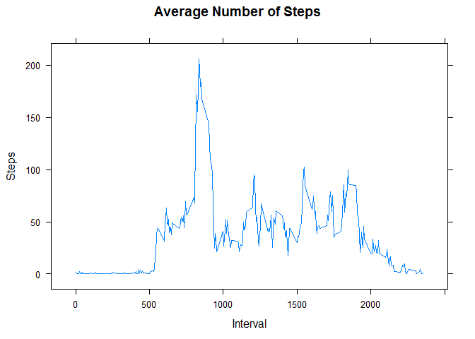

# Reproducible Research: Peer Assessment 1
<!-- Author C. Daniels --> 
<!-- Due Date: 9/20/2015 --> 

## Introduction
The purpose of this project is to analyze data from a personal activity monitoring device. The data used is from anonymous individual collected during the months of October and November, 2012 and includes the number of steps taken in 5 minute intervals each day. 

## Initialization
### Load R libraries 

```r
library(lattice)
```

## Loading and preprocessing the data
The dataset for this analysis is available in the GITHUB repository so it is not necessary to download the data separately. The data is contained in activity.csv, a comma-separated-value (CSV) file, with a total of 17,568 observations. 


```r
ACT <- read.csv("activity.csv")
ACTALL <- ACT           ## includes all observations
ACTNoNA <- na.omit(ACT) ## observations with NA's removed
```

## What is mean total number of steps taken per day?

```r
StepsDay <- aggregate(ACTNoNA$steps, by=list(ACTNoNA$date), FUN=sum)[2]
Steps <- unlist(StepsDay[,1])
hist(Steps, ylim = c(0, 35))
```

 

```r
cat(paste ("Result With N/A values omitted:", '\n',
           "  Mean Steps per day", mean(Steps), '\n',
           "  Median Steps per day", median(Steps)))
```

```
## Result With N/A values omitted: 
##    Mean Steps per day 10766.1886792453 
##    Median Steps per day 10765
```

## What is the average daily activity pattern? 

```r
ADA <- aggregate(ACTNoNA$steps, by=list(ACTNoNA$interval), FUN=mean) #output interval and total steps
names(ADA)[1]<-"Interval"
names(ADA)[2]<-"MeanSteps"
xyplot( MeanSteps ~ Interval, ADA, type="l", main="Average Number of Steps", ylab="Steps")
```

 

```r
maxsteps <- ADA[which.max(ADA[,2]), 1] ##interval that contains max number of steps
cat(paste("On average, interval: ", maxsteps, " contains the maximum number of steps."))
```

```
## On average, interval:  835  contains the maximum number of steps.
```

## Imputing missing values
The input data contains missing values (coded as NA). This portion of the project is to determine how many missing values exist and analyze the effect of replacing them with imputed values.

```r
NArows <- nrow(ACTALL)  - nrow(ACTNoNA)
cat(paste(NArows, "of the ", nrow(ACTALL), "rows in Activity.csv contain missing values."))
```

```
## 2304 of the  17568 rows in Activity.csv contain missing values.
```
The method for imputing missing values is to replace each missing value with the average value for  interval. We will then assess the effect replacing NA's with imputed values.

```r
ACTALL$steps[which(is.na(ACTALL$steps))] <- ADA$MeanSteps[match(ADA$Interval, ACTALL$interval)]
StepsDayI<- aggregate(ACTALL$steps, by=list(ACTALL$date), FUN=sum)[2]
StepsI <- unlist(StepsDayI[,1])
hist(StepsI, main = "Histogram of Steps using Imputed Values", xlab = "Steps")
```

 

```r
cat(paste ("Result With N/A values imputed:", '\n',
           "  Mean Steps per day", mean(StepsI), '\n',
           "  Median Steps per day", median(StepsI)))
```

```
## Result With N/A values imputed: 
##    Mean Steps per day 10766.1886792453 
##    Median Steps per day 10766.1886792453
```


```r
cat(paste ("Difference between using NA values and imputed values:", '\n',
           "  Mean:", (mean(Steps) - mean(StepsI)), '\n',
           "  Median:", (median(Steps) - median(StepsI))))
```

```
## Difference between using NA values and imputed values: 
##    Mean: 0 
##    Median: -1.1886792452824
```
The result of replacing the NA values with the average values had no effect on the Mean and very small effect on the Median.  

## Are there differences in activity patterns between weekdays and weekends?


```r
wend <- c("Saturday", "Sunday")
ACTALLW <-ACTALL

ACTALLW$DOW <- weekdays(as.Date(ACTALLW$date, format='%m/%d/%Y'))
ACTALLW$wDay <- factor(ACTALLW$DOW %in% wend, levels=c(TRUE, FALSE), labels=c('weekend', 'weekday'))
StepsInt <- aggregate(ACTALLW$steps, by=list(ACTALLW$wDay, ACTALLW$interval), FUN=mean)
names(StepsInt)[1] <- "wDay"
names(StepsInt)[2] <- "Interval"
names(StepsInt)[3] <- "steps"
xyplot(steps ~ Interval|wDay, data=StepsInt, type="l", layout=c(1,2), ylab="Number of steps")
```

 

